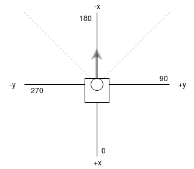

# lidar2d

*Base configuration for installation and interaction with either a 2d lidar*

Currently Supported:

  - [HLDS HLS-LFCD-LDS](https://github.com/ROBOTIS-GIT/hls_lfcd_lds_driver)
  - [Hokuyo URG](http://wiki.ros.org/urg_node)


## Install

Clone this repository into your src folder

Install deps:

```
rosdep install --from-paths src --ignore-src -r -y
```

For HLDS HLS-LFCD-LDS, clone the driver into your catkin workspace `src` folder:

```
catkin_ws/src$ git clone https://github.com/ROBOTIS-GIT/hls_lfcd_lds_driver.git
```

## Running

To launch the lidar and detect nodes:


### HLDS

```
roslaunch lidar2d hlds.launch
```

### URG 

```
roslaunch lidar2d urg.launch
```


### Interactive Interface


To launch the interactive interface:

```
roslaunch lidar2d interactive.rviz
```

### Axes for HLDS Lidar


